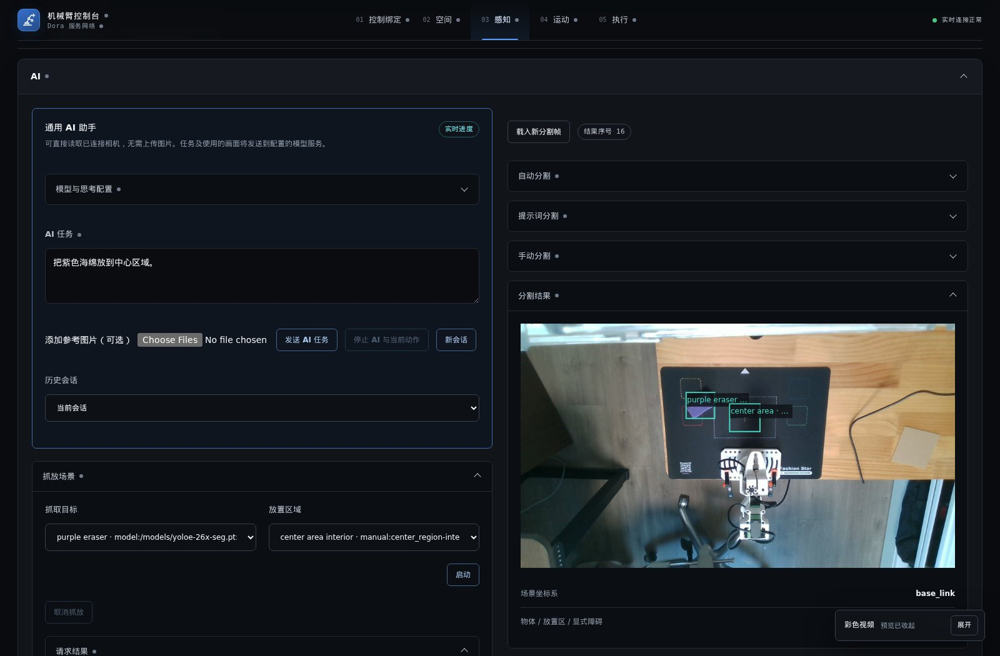

English | [简体中文](README.zh-CN.md)

# Robot Arm

An intelligent robot control platform. Connect cameras, input devices and a robot arm through a browser to observe a scene, control the robot and carry out physical tasks.

[Control Binding](#control-binding) · [Space](#space) · [Perception](#perception) · [Motion](#motion) · [Execution](#execution)

## About the project

There is a sponge on the desk, and you want the robot to put it in a marked area. Describing the task is easy. Making it happen involves several questions: what is the camera seeing, where is the object, which way should the fingers approach, will the arm hit the table, and did the gripper actually hold it?

Robot Arm brings those parts into one workspace. Camera images, object annotations, 3D localization, joint controls, motion progress and servo feedback are available together. You can select the objects yourself or ask a vision-capable language model to use the available tools. The manual controls remain available when you want to make an adjustment.

The project runs on physical hardware. The current setup uses a StarArm-102 six-axis arm and a RealSense D415, and has performed real pick-and-place with sponges and other objects. The robot shown in the browser follows motor feedback; it is not simply replaying a demonstration animation.

We want both kinds of interaction to be practical: direct access to joints, coordinates and device settings when you need them, and an image or a conversation when you would rather describe the task. The following sections follow the five modules in the interface.

## What you can do with it

### Have the arm move something on your desk

Place the object and destination in view, use the saved calibration and select the targets—or describe the task to the AI. Recognition, localization, grasp selection, planning and execution belong to the same task. You can follow the active stage while keeping the floating video open to watch the physical movement.

If a model misses the target, try another description or draw the region yourself. A place to put an object does not need to have a convenient category name: you can annotate it as a destination. Human selections and model results can contribute to the same operation.

### Operate it yourself with a controller

Use directional buttons, sticks or a tracked controller to find a useful pose. Choose which inputs affect position and which affect orientation, then adjust movement scale and direction. The resulting joint angles, end-effector position and robot pose remain visible.

This is also a way to become familiar with an arm: begin with one direction and one action, observe the response, then enable more components. Trying a tool rotation does not require writing a new controller program.

### Ask an assistant that can use the workspace

Sometimes the task is “what can the camera see?”, sometimes it is “return to the working pose,” and sometimes it is a complete pick-and-place. The AI can inspect both images and device state, then use movement and gripper tools when requested. Follow-up questions and reference images stay in the conversation.

These are examples of instructions at different levels, not additional hard-coded task presets:

| Intent | Example instruction |
| --- | --- |
| Observe | “Look at the camera image and tell me what you see. Do not move yet.” |
| Inspect the robot | “Read the current joint angles and gripper load feedback.” |
| Prepare | “Return to the working pose.” |
| Make an adjustment | “Move forward 1 cm along the tool's own direction.” |
| Adjust holding | “Set the gripping feedback target to 30.” |
| Pick and place | “Put the purple sponge in the center area.” |
| Follow up | “What stage did the last task reach?” |

The model's tools correspond to the functions a person can use in the interface. You can delegate a task and still inspect what it did.

### Develop an application—or study the robot itself

Work on image segmentation without connecting an arm. Use one RGB-D observation to inspect object localization and grasp candidates before moving on to planning. When tuning hardware, inspect raw motor feedback and editable parameters. When investigating geometry, use the 3D robot view and the MoveIt/RViz scene.

These functions have their own entry points. Pick-and-place combines them, but viewing a camera or running segmentation does not force a complete task to start.

## Control Binding

### Choose how you want to operate the arm

You can start with the browser's directional controls, without a gamepad. Buttons cover forward/backward, left/right, up/down, pitch, turning and rotation around the tool axis. Hold a button to move and release it to stop. This is useful when standing beside the robot and adjusting one direction at a time.

For continuous input, connect an SDL3-supported gamepad. For tracked position and orientation, use a NOLO CV1 device. The page shows discovered devices and their reported capabilities, and lets you give them recognizable names.

Position and orientation sources can be selected independently. One device can supply position while another supplies orientation. A controller without tracking can still drive relative movement through buttons and sticks.

### Make the bindings fit your hands

Bindings describe actions rather than a fixed layout for one particular controller. An action can use a button, a continuous axis or a positive/negative button pair. Directions can be inverted, and inputs can be reassigned when you change devices.

Available actions include translation, arc motion, tool rotation, movement along the tool axis, gripper opening/closing and control takeover. Position changes and tool orientation can be operated separately.

Devices with vibration support can also receive feedback associated with gripper load. Input and feedback mappings are configured in the same workspace rather than in a separate controller application.

### Inspect the input before using it

The input test shows the selected device's buttons, axes and pose information. You can check which button is pressed, whether a stick has returned to neutral and whether tracking is updating. Simulated input is available for checking bindings as well.

Names and bindings can be saved. Raw poses, control input and discovery state can be expanded when diagnosing a problem, without occupying the main workspace during normal use.

## Space

### Give “a little farther forward” a consistent meaning

The controller's forward direction, the operator's forward direction and the robot's forward direction may be different. The Space module defines their relationship before movement reaches the motion and execution layers.

You can map input axes to forward, left and up, change the translation scale and establish a relative reference from the position and orientation at takeover. Hand movement does not have to translate into the same distance at the robot, and a tracking device's absolute coordinates do not become robot targets directly.

The page displays the operator-space pose, device orientation, translated movement and current control state. This gives you something visible to compare while adjusting the mapping.

### Decide what a turn of the controller should do

Tilting a controller down might mean moving the arm along an arc, or it might mean pitching the tool in place. These are separate choices:

- Vertical orientation can control a vertical arc or tool-centered pitch.
- Horizontal orientation can control a horizontal arc or tool-centered turning.
- Base-frame translation, tool-axis translation, axial rotation and helical motion have separate components.
- Components that are not needed can be disabled so an input affects only the intended movement.

Without absolute position or orientation, configured linear and arc angular speeds turn buttons and axes into relative motion. These conversions live in the spatial layer instead of being repeated in each controller and robot driver.

## Perception

The Perception page places camera configuration and calibration first, followed by a shared AI workspace. You can inspect the scene, work on segmentation, reconstruct targets and select a pick-and-place task on the same page. Configuration and tools that are not in use can be collapsed.

### Camera sources and settings

The camera list shows the model, serial number, connection information, driver and supported stream profiles. Resolution, pixel format and frame rate come from what the device actually reports. Unavailable options remain visible with their status.

The interface lets you:

- Refresh device discovery, select a camera, save and enable its configuration, reset it or stop capture.
- Select the color and depth stream resolutions, formats and capture rates.
- Set perception publication frequency independently. For example, perception can receive one frame per second while the live video continues at the camera capture rate.
- Inspect and adjust RealSense-specific driver options.
- View color, depth, camera intrinsics and extrinsics.

The color preview can float, move and collapse, so you can keep watching the scene while using another part of the workspace. Still-image previews also have a refresh action for checking the scene after moving an object.

The page shows more than requested settings: active color/depth profiles, measured capture/publication rates, device frame drops, intentionally skipped frames and the latest frame sequence. This helps distinguish reduced-rate perception sampling from missing device frames.

Camera profiles and applied calibrations are saved by the backend and associated with device identity, not a temporary enumeration index or USB port. After a restart, you select and enable the camera again; its saved configuration and calibration remain available.

### Camera extrinsic calibration

A camera fixed in the scene needs a position and orientation relative to the robot base. Extrinsic calibration establishes that relationship so observed 3D points can be expressed in robot coordinates.

With a ChArUco board installed, start automatic calibration from the browser. The arm visits the working pose, moves through the device-defined sample poses, captures observations, solves the transform and returns to the working pose. The page shows the active pose, recorded samples, what the process is waiting for and the final fit.

Sampling uses fresh, actual motor feedback to calculate the end-effector pose instead of assuming that commanded angles were reached. Board parameters can be expanded and edited. Applying the solution saves it; the previous calibration values remain visible, with an explicit recalibration action.

Board settings include the grid, dictionary, square and marker sizes, and measured board width and height. Results include overall fitting RMS, maximum residual and per-sample translation/rotation residuals. An existing applied calibration remains in place during recalibration until a replacement is confirmed.

### Segmentation: let people and models identify the targets

Not every object is easy to name, and not every task should depend on finding the right prompt. Three complementary methods are available:

| Method | How you use it |
| --- | --- |
| Prompted segmentation | Describe the object for YOLOE, or supply a reference image and visual prompt boxes. |
| Automatic segmentation | Run the prompt-free model to see which objects it can find without class names. |
| Manual annotation | Draw a target or placement region on the original image and give it a recognizable name. |

Each method has its own collapsible controls. Running one model updates its results without removing the other model's results or manual annotations. Results can be cleared by source. Manual boxes can be edited, removed and saved without rerunning the entire perception process.

All results appear together as boxes and titles over the original image. Selecting a title opens details such as its source and model confidence. Manual annotations retain their manual provenance. The manual editor shows only manual boxes so model results do not obscure the editing task.

Segmentation operates on a frozen frame. Loading a new frame starts a new observation; subsequent 3D reconstruction uses the depth belonging to that same frame.

This image combines a model-detected grasp target with a manually annotated center destination. The names are task labels; the destination was not identified by the model.

### Turn image regions into 3D targets

Segmentation alone does not require a connected arm or an extrinsic calibration. When a task needs physical locations, reconstruction combines depth, intrinsics and saved extrinsics to recover object positions, extents and instance point clouds.

Reconstruction is a separate operation and does not rerun segmentation. Once an object is selected, GraspGenX generates candidate gripper poses. The motion module then considers robot reachability and the collision scene to find an executable solution.

Manual pick-and-place consists of selecting an object, selecting a destination and starting the task. It reuses the observation already selected. A new scene requires a new selection. The page follows candidate preparation, planning, execution and the result throughout the request.

### Work through a conversation

You can also ask “put the purple sponge in the center area” and let the AI call those capabilities. Camera tools provide images directly; there is no need to download a camera frame just to upload it again. Image attachments are available when you want to add reference information.

The AI currently has tools to:

- Read actual joints, TCP, gripper load and robot connection state.
- Inspect camera configuration, the current scene, segmentation and annotation sources.
- Obtain a fresh camera image or load a frozen segmentation frame.
- Run segmentation, add image boxes, reconstruct 3D instances and generate grasps.
- Select objects, start pick-and-place and follow the same request's progress and result.
- Return to the working pose, set joint targets and request absolute or relative TCP movement.
- Open or close the gripper, adjust its continuous holding target and cancel a specified task.

A conversation can continue around an existing task or simply ask about state. Conversations retain user messages, model replies and tool records. You can start a new session or return to an earlier one.

The model endpoint, model name and reasoning level are configurable in the page. Models and reasoning levels support both selection and manual input. The integration uses the OpenAI-compatible Responses API, with credentials kept on the server. Expand execution details to inspect tool calls, associated robot requests and the current stage.

Settings include model-list refresh and a connection check, and distinguish draft configuration from effective settings. Selecting a general AI model does not disable either segmentation model. A stop action covers the AI run and its current robot action.

AI tools operate through the same interfaces as the manual pages. Perception, localization, planning and execution each provide results that the model can read while working. Whether an object was physically held, and where it ended up, still needs to be judged from actual observation.

The task text in this screenshot is an unsent example; the right-hand image combines existing model results and manual annotations.

## Motion

### Adjust a target before moving

Manual joint control follows an edit, preview and execute interaction. Moving a slider changes a draft target without immediately driving the arm. During editing, actual and target robot models are shown together. You can also restore the actual pose and discard the draft.

Alongside joint targets, the interface supports named poses such as the working pose, independent gripper control and end-effector TCP targets. TCP movement can be absolute in the base frame or relative in either the base or tool frame. Moving along the tool's own direction does not require manually converting that movement into three base-frame coordinates.

Current and target TCP position/orientation, planning results, trajectory point counts and planned duration are visible. Ordinary motion requests can override settings such as speed for that request. The target model remains a geometric preview; planning determines whether the motion is reachable.

### Continuous control and complete pick-and-place

MoveIt Servo handles continuous relative control, while motion planning handles discrete manual targets and perception tasks. Both use the same robot model, coordinate relationships and execution feedback.

MoveIt Task Constructor organizes pick-and-place stages. Perception supplies multiple candidates, and planning searches for complete executable solutions, considering candidate quality, posture changes and motion cost. An IK failure for an individual candidate is not sent to the robot as an action.

Approach depth is refined using the gripper's geometry and collision checks. After grasping, the target is attached for transport collision checking. The task continues through carrying, release and return to the working pose. Placement posture selection also considers its connection to the surrounding movements.

Environment geometry comes from the same observation's point cloud through MoveIt's official Octomap component. Contact with the grasp target, attachment, transport and release are handled by the appropriate task stages.

### Follow what the robot is doing

A task exposes its request ID, stage, complete solutions and execution state. You can distinguish preparation from planning, and planning from actual execution.

Results can be looked up by request ID, including after refreshing the page. Cancellation is available, and the interface continues to follow the actual task feedback afterward. The operator page, AI conversation and backend execution can therefore refer to the same operation.

For closer inspection, expand MoveIt/Servo state, current and target end-effector poses, planning results and robot metadata. A browser-accessible RViz interface is also available for viewing the robot, point clouds and planning scene. These views complement the normal operator workspace when you need to examine spatial relationships.

## Execution

### See the physical arm, not just the target

The Execution page is where you inspect the hardware. Its 3D robot view follows actual motor feedback, alongside the last command, current joints and tool target. The distinction remains visible when a command has been issued but a motor has not yet reached it.

Serial ports can be selected from a list or entered manually. Connection state, the active endpoint and errors are displayed. Previous readings are marked as historical after disconnection. Whole-arm torque enable and release are available here too.

### Keep holding after the fingers close

With a soft object such as a sponge, reaching a closing angle is not the same as maintaining a useful grip. The execution layer continues adjusting from servo load feedback during transport until an explicit opening or torque-release operation.

You can set the holding-feedback target and inspect measured feedback, control power, sampling time and regulation state. The target uses a normalized 0–100 load scale, not newtons. Contact differs between objects; camera observations help you judge slipping or loss of grip and adjust the target accordingly.

### Inspect servo information and settings

The native Rust driver reads FashionStar servo information, status and configuration and supports corresponding parameter writes. The page exposes:

- Reported motor angles, turn counts and status flags.
- Voltage, current, power and raw temperature readings.
- Firmware codes, device information and supported configuration fields.
- Parameter units, purpose, write availability and when changes take effect.
- Read progress, the most recent read time and per-field errors.

The actual feedback polling interval is configurable. Queries, replies and writes share one serial scheduler instead of competing for the port from different modules. Detailed parameter meanings live in the robot documentation; routine inspection and adjustment are available in the execution interface.

## What stays between visits

Device names and bindings, spatial mappings, camera profiles, confirmed calibrations and non-sensitive AI settings are saved by their owning services. Conversations and robot request records are retained too, so inspecting an operation does not depend on keeping the original browser tab open.

A new camera image is distinct from an old annotation. After moving an object, load a new observation; the frozen frame does not silently change underneath its boxes. Model annotations, manual annotations and 3D instances retain their source relationships.

Details and diagnostics can be expanded when needed. Routine operation focuses on images, targets and progress; request IDs, coordinates, parameters and raw feedback are there for closer inspection. You can learn the system gradually rather than needing to understand every robotics term on the first visit.

## Current support and project structure

The current physical setup is a StarArm-102 six-axis arm with RA8-U35H-M servos and a RealSense D415. Input adapters support SDL3 gamepads and NOLO CV1. Other hardware can be integrated at the adapter layer, but this does not mean every arm or camera is already supported.

The backend primarily uses Rust and Dora; the browser interface uses Next.js, React and Three.js. Camera and image processing use librealsense and OpenCV, with YOLOE and GraspGenX for perception. Motion uses ROS 2, MoveIt 2, Servo and MTC. Redis stores requests and AI conversations, and service dependencies are maintained in their respective Docker images.

Simulated and real inputs follow the same business pipeline, and AI and manual operation reuse the same capabilities. Once dependencies and model weights are available, local segmentation, manual control and pick-and-place do not require an external language-model service. Conversations require a model endpoint; internet access depends on where you host that endpoint.

This is a desktop robot project. Printed calibration boards, depth measurements, mechanical play, gripper shape and object materials all affect the result. Feedback and observation remain accessible so those differences can be inspected and adjusted.

For implementation details, see [Architecture and call chains](docs/BACKEND.md) and [Robot and servo parameters](docs/STARARM-102.md). Deployment instructions are kept in [Docker and service images](docs/DOCKER.md). These technical documents are currently in Chinese.

Screenshots are from the running interface. The 3D arm is a hardware-feedback visualization; the manual annotations in the camera image are explicitly identified.
