[English](README.md) | 简体中文

# Robot Arm

面向真实机械臂的智能控制平台。在浏览器中连接设备、观察环境、控制运动，也可以用自然语言让机械臂完成抓取与放置。

[控制绑定](#控制绑定) · [空间](#空间) · [感知](#感知) · [运动](#运动) · [执行](#执行)

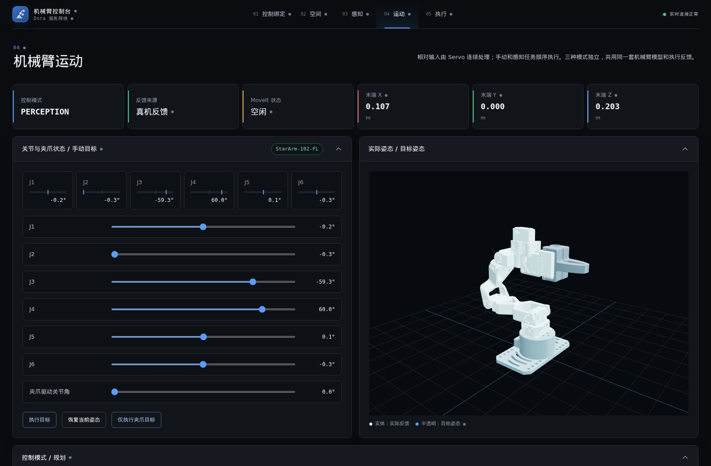

## 项目概述

Robot Arm 将机械臂、深度相机、手柄和 AI 整合到同一个操作界面。既可以逐步控制机械臂，也可以直接描述任务，由系统完成观察、目标定位、路径规划和动作执行。

例如，输入“把紫色海绵放到中心区域”，AI 可以查看相机画面，调用物体识别和定位功能，再发起抓放。操作过程中，页面显示当前阶段、机械臂反馈和执行结果。AI 使用的正是页面中已有的功能，用户可以查看它的操作，也可以直接使用这些功能。

项目已经在 StarArm-102 六轴机械臂与 RealSense D415 深度相机上完成实物抓放。它面向桌面机器人操作、交互研究和应用开发；抓取效果仍受物体材质、夹爪形状、相机观测和机械精度影响。

**无需机械臂、深度相机或手柄也可以使用。** 项目提供整套测试数据和虚拟关节反馈，可以先在电脑上体验操作、识别、标定和抓放规划，再接入真实设备。

### 三种操作方式

| 方式 | 如何使用 | 适合的任务 |
| --- | --- | --- |
| 自然语言 | 描述任务，由 AI 调用平台功能 | 查看场景、查询状态、控制运动和抓放 |
| 页面操作 | 查看图像、选择目标、点击执行 | 希望明确控制每一步，或不使用通用 AI |
| 手柄与空间控制器 | 通过按键、摇杆或设备移动控制机械臂 | 连续调整位置、朝向和夹爪开合 |

这三种方式共用机械臂的规划与执行能力，不需要分别配置三套机器人系统。

### 五个模块

| 模块 | 主要用途 |
| --- | --- |
| 控制绑定 | 决定哪个设备、哪个按键负责什么动作 |
| 空间 | 决定设备的移动方向和幅度如何对应机械臂运动 |
| 感知 | 查看相机、识别物体、确定位置，并通过 AI 下达任务 |
| 运动 | 设置目标姿态，规划机械臂如何到达和完成抓放 |
| 执行 | 连接真实机械臂，查看电机反馈并调整夹持与设备参数 |

### 无需硬件即可体验

准备好运行环境和模型文件后，不连接任何外部机器人设备，也能使用同一个网页和完整的软件流程：

- **模拟相机与整套测试数据**：内置方块、置物筐和地面的测试场景，提供配套的彩色图、深度数据和相机参数，用于物体识别、三维定位及点云生成。
- **标定体验**：提供配套标定板数据，可随虚拟机械臂姿态生成观测，运行采样与标定流程，不需要打印或安装实体标定板。
- **虚拟关节反馈**：执行层支持软件模拟，根据下发目标更新关节与夹爪状态，页面中的三维机械臂随之变化；不只是显示一个静止模型。
- **操作与抓放流程**：可以使用页面控制或模拟输入，选择测试场景中的物体和放置区，运行识别、定位、路径规划与模拟执行。配置好通用模型服务后，也可以通过 AI 操作。

模拟与真机共用业务流程，页面会明确显示反馈来自“软件模拟”还是真实设备。模拟用于体验和验证软件链路，不代表对摩擦、滑脱等物理现象的完整仿真，也不能替代真实物体抓取验证。

## 控制绑定

将输入设备上的按键、摇杆和空间运动，分配给机械臂的具体动作。更换控制设备时，可以调整绑定，不需要重新编写运动逻辑。

### 选择控制设备

- 支持通过 SDL3 接入的手柄，以及 NOLO CV1 空间跟踪设备。
- 显示设备名称、连接状态和可用的按键、摇杆、位置与朝向信息。
- 可以由一个设备负责位置、另一个设备负责朝向，也可以集中使用一个设备。
- 页面提供方向控制，不连接外部控制器也能操作平移与旋转。
- 设备名称和绑定配置可以保存，便于后续继续使用。

### 分配动作

按键可以触发动作，摇杆可以连续控制，一对按键也可以分别负责正反方向。例如，将两个按键分配给夹爪打开与闭合，或将摇杆分配给前后移动。如果操作方向与习惯相反，可以直接反转该项绑定。

可分配的动作包括平移、绕弧移动、夹爪自身旋转、沿夹爪指向前进或后退，以及夹爪开合。支持振动的设备还可以接收夹持负载反馈。

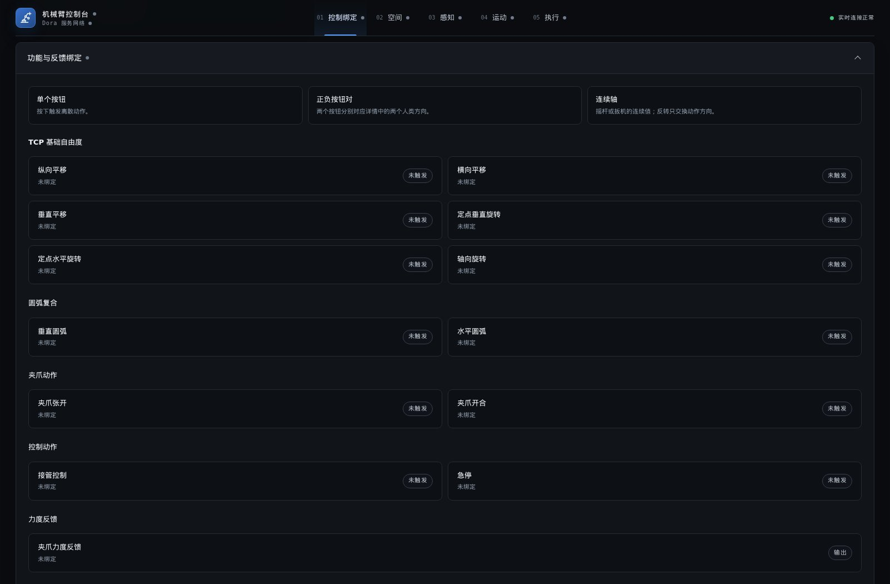

### 确认输入是否正确

页面显示实际按键、摇杆和空间输入，便于先检查设备是否识别、方向是否正确，再进行机械臂操作。模拟输入也可以用于检查绑定与方向设置，不必依赖全部外部控制器到位。

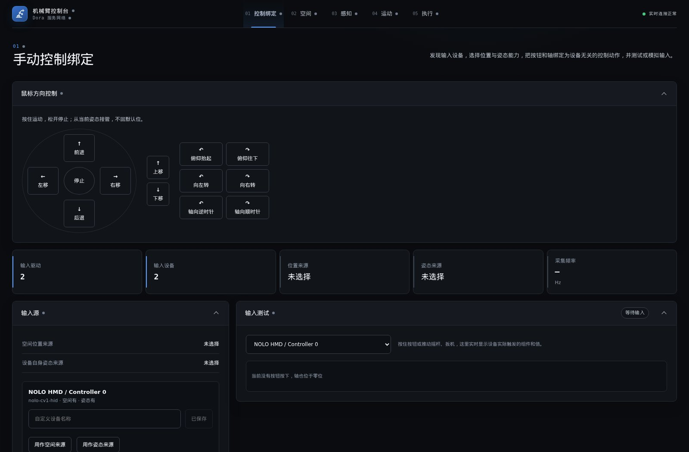

## 空间

让控制设备的运动与机械臂的运动对应起来。设备向前移动时，机械臂应该往哪边走、走多远，以及设备转动时应该改变位置还是改变夹爪朝向，都在这里设置。

### 调整方向和比例

- 设置输入设备的各个方向如何对应机械臂的前后、左右和上下。
- 调整移动比例，让较大的手部移动对应较小的机械臂位移，或反过来。
- 开始接管控制时，以当时的设备姿态建立相对参考，之后按变化量控制。
- 对没有空间跟踪能力的手柄，使用按键或摇杆产生连续移动。
- 保存空间配置，并通过三维视图检查方向关系。

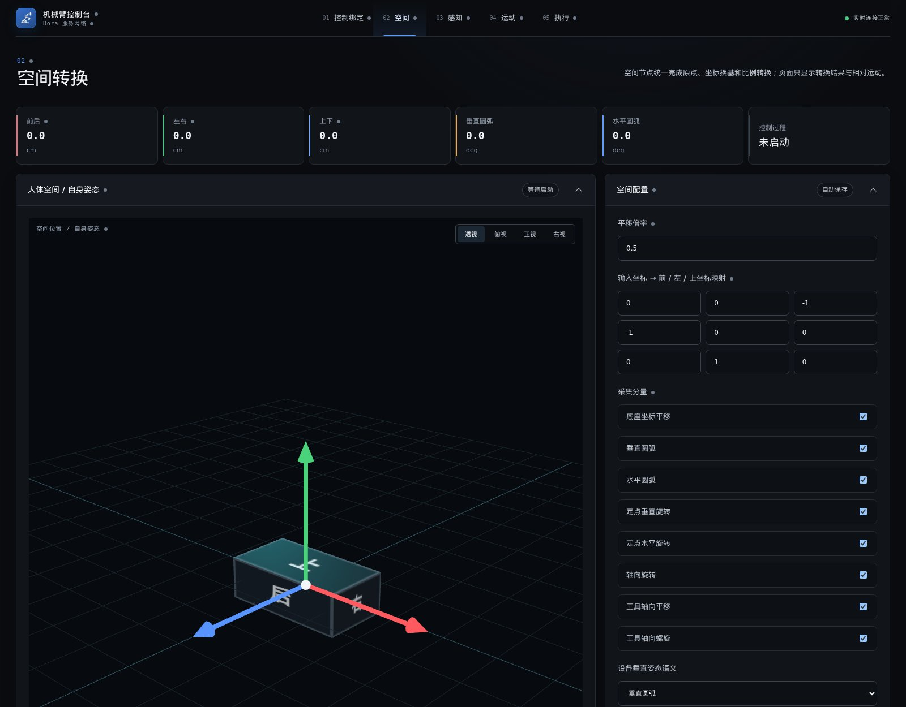

### 区分位置和朝向

改变夹爪位置与改变夹爪朝向是两类操作。例如，向上抬起夹爪，不一定需要让夹爪跟着翻转；让夹爪转向，也不一定需要移动它的位置。

平台支持直线移动、绕弧移动、在当前位置调整朝向、绕夹爪自身轴线旋转，以及沿该轴线移动。这些动作可以分别启用，按所需的操作方式组合。

三维视图提供不同观察方向，并显示当前的位移和旋转量，帮助核对设置。坐标映射等较详细的配置也保留在页面中，但日常使用不需要反复调整。

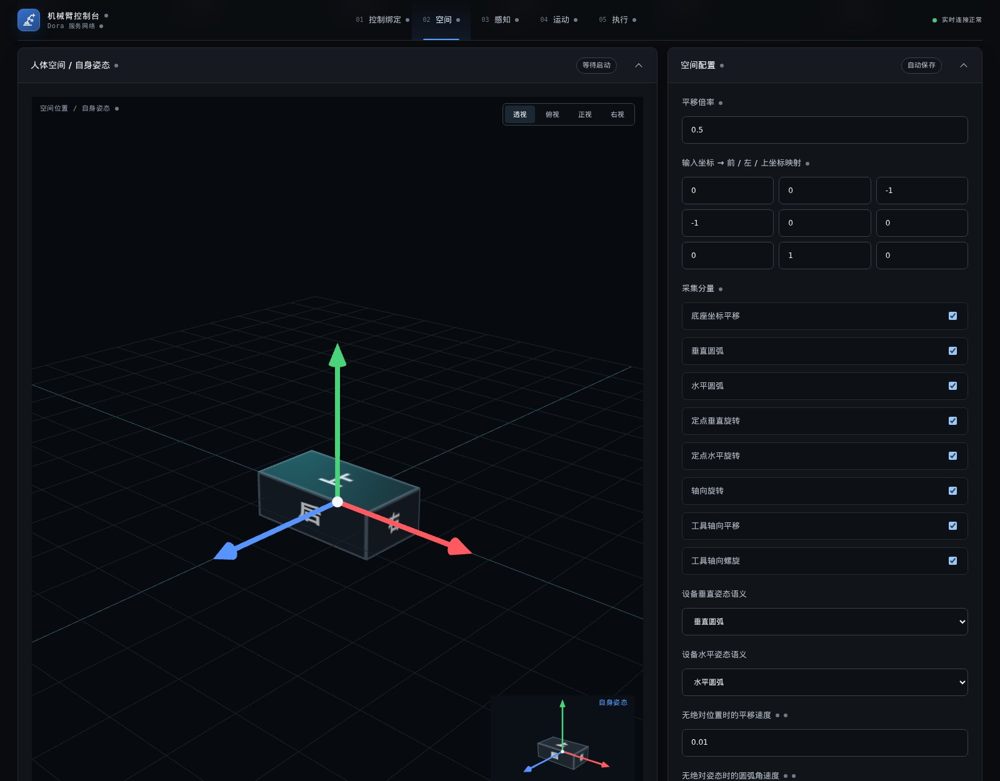

## 感知

让机械臂知道“看到了什么、物体在哪里、应当抓哪个”。相机、标定、物体识别和 AI 任务集中在同一页面，既能分别使用，也能组合完成抓放。

### 查看和配置相机

页面显示相机来源、设备信息、彩色图像和深度数据。彩色图像用于观察物体外观；深度数据提供相机到物体表面的距离，帮助系统把图像中的位置转换为真实空间中的位置。

- 根据设备实际支持的能力选择分辨率和帧率；不可用的配置显示为不可选。
- 分别设置相机采集速度和供后续处理使用的取样频率。例如，相机持续采集，而识别只按需要取帧。
- 查看实际运行的分辨率、帧率和采集状态，区分已选择的配置与当前生效的配置。
- 使用可拖动、可收起的彩色视频窗口观察现场，独立刷新深度预览。
- 查看并调整相机驱动提供的参数，保存设备配置。

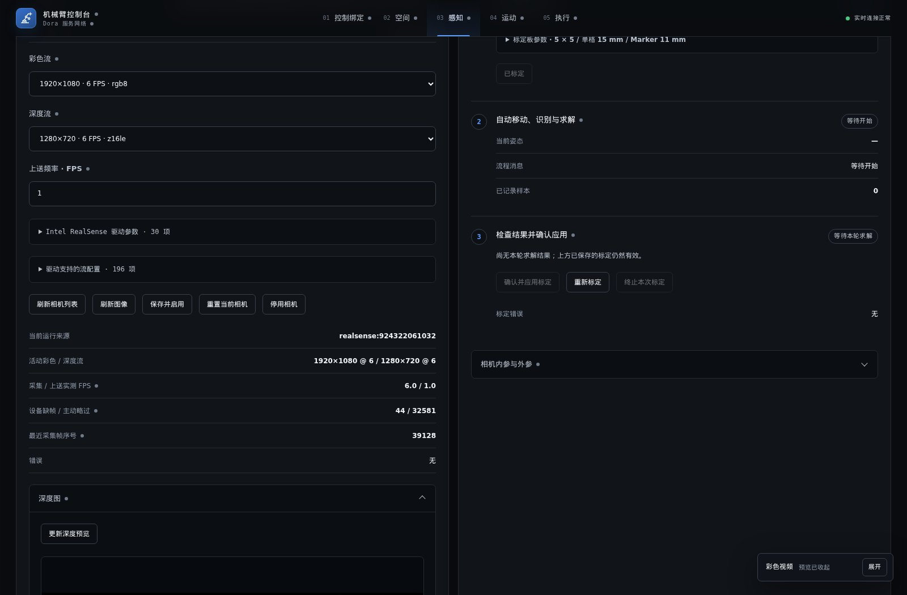

### 让相机位置与机械臂对应：标定

相机知道物体相对自身的位置，机械臂则需要知道物体相对底座的位置。标定用于建立两者之间的关系。

平台使用带有黑白图案的 ChArUco 标定板。安装好标定板后，机械臂依次移动到预设姿态，相机采集图像，系统结合电机实际反馈计算相机与机械臂的位置关系。页面展示当前姿态、已采集样本和计算结果。

标定流程包含移动、采样、求解和返回工作位。用户可以检查拟合误差，再确认应用结果；已保存的标定可以在刷新或重启后继续使用，需要时再发起重新标定。

拟合误差用于判断本次采样的一致性，不等于机械臂实际操作的全部误差。标定板尺寸、相机深度质量和机械结构精度仍然会影响最终定位。

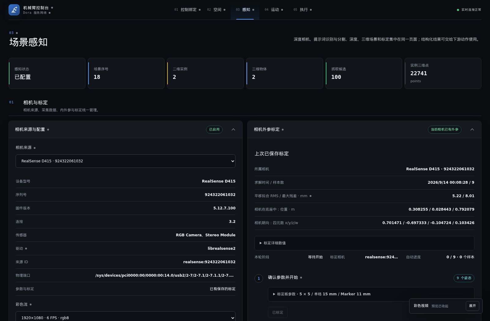

### 三种方式选择物体

“分割”是指在图像中选出物体或区域。平台提供三种方式，可以单独使用，也可以组合使用：

| 方式 | 使用方法 |
| --- | --- |
| 提示词分割 | 输入物体描述，或使用参考图中的区域，让模型寻找对应目标 |
| 自动分割 | 不输入物体描述，由模型直接给出识别结果 |
| 手动分割 | 在画面中框选目标或放置区域，并设置名称 |

三种结果汇总在同一张原图上，标明各自来自哪个模型或人工标注。点击标签可以查看详情；人工编辑区只显示人工标注，避免与模型结果混在一起。

每种来源都可以独立运行或清除。更换提示词模型不需要关闭自动分割，也不会删除手动区域。模型没有找到合适的放置区时，可以直接手动框选。

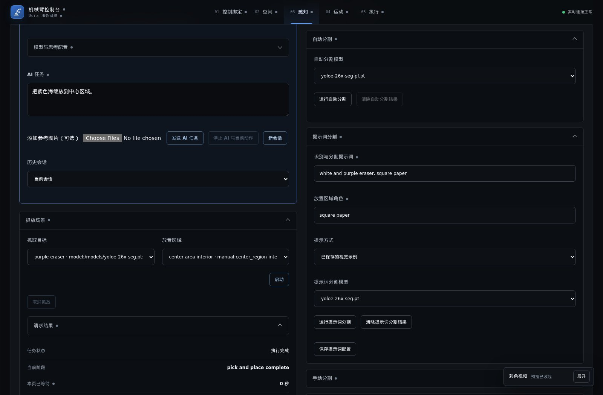

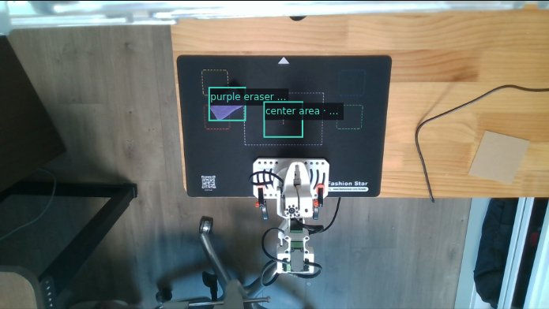

上图中，抓取物来自模型识别，中心放置区来自人工标注，并非全部由模型自动识别。

### 从图像中的目标到实际抓放

选择目标后，系统使用对应的深度图计算三维位置，再生成多种可能的抓取姿态。运动模块从中寻找机械臂能够到达、并且能够完成后续搬运的方案。

识别、三维定位和抓放可以分别触发。只查看识别结果时，不需要先连接机械臂或完成标定；实际抓放则需要有效的空间位置和机械臂连接。

手动抓放的操作是：查看结果，选择抓取物与放置区域，然后启动。页面继续显示候选准备、规划、执行和最终结果，而不是在发送请求后结束。

### 使用自然语言

AI 不只用于抓放。它可以查看相机画面、读取机械臂状态、调用分割与定位、移动机械臂、调整夹爪，以及查询任务进度。

例如：

- “查看当前画面，说明有哪些物体。”
- “机械臂回到工作位。”
- “沿夹爪当前指向前进 1 厘米。”
- “把紫色海绵放到中心区域。”

AI 可以直接使用系统相机图像，也可以接收用户上传的参考图片。对话支持多轮沟通、历史会话和新建会话，工具操作及关联的机器人任务可以展开查看。

模型名称和思考强度支持下拉选择或手动输入；思考强度用于向模型请求不同程度的推理，实际支持情况取决于模型服务。平台接入 OpenAI 兼容的 Responses 接口，可使用支持图像与工具调用的模型服务；服务可以位于本地网络，也可以是远程服务。任务文字和使用的图片会发送到所配置的服务，密钥仅在服务端使用。

AI 的回复与机械臂的执行结果分别展示。回复结束不代表动作已经完成，用户仍可查看任务进度、真实反馈，并停止当前 AI 与动作。

### 示例：AI 驱动的抓放过程

任务：“紫色物体放到红色框区域，然后再从红色框区域放到中心。”

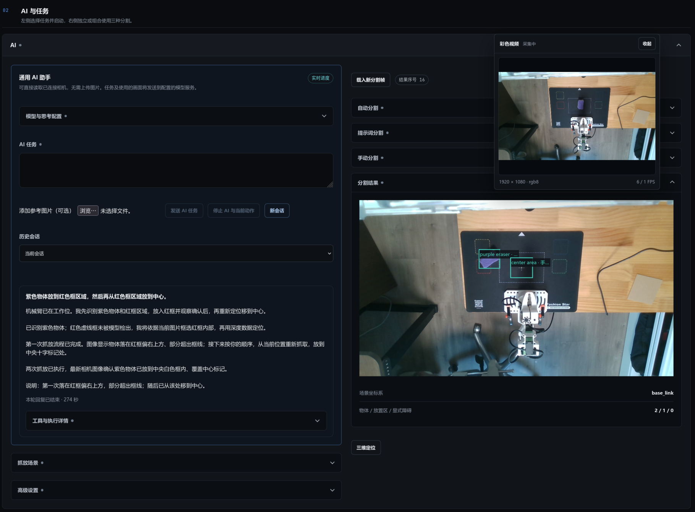

用户提供的实际操作截图。左侧记录 AI 的识别、区域框选、抓放与图像检查过程；右侧大图是用于定位的分割画面，右上角实时视频显示后续物体状态。记录也保留了第一次放置偏出红框的情况，随后按指令再次抓取并放到中心。

## 运动

将“希望机械臂到哪里”转换为具体的关节运动。既支持手动调整，也支持根据视觉结果执行完整抓放。

### 先预览，再执行

编辑关节角度时，机械臂不会立即运动。页面同时显示当前反馈姿态与待执行目标，便于观察修改的效果，再点击执行。

除关节角度外，还可以设置夹爪末端的位置和朝向，或让它相对当前位置移动。相对运动既可以按底座的方向，也可以按夹爪自身的方向解释；“向前移动”和“沿夹爪指向前进”因此可以明确区分。

支持工作位等预设姿态、独立夹爪控制，以及按住操作、松开停止的连续控制。目标预览用于显示希望到达的姿态；是否可达、路径是否可行，由规划过程确定。

工作位是预先设置的一组机械臂关节位置，用作动作的起点或结束位置。

### 为抓放选择可执行方案

系统会考虑多种抓取姿态，而不是只使用模型评分最高的一种。判断内容包括机械臂是否够得到、夹爪能否合理接近物体，以及抓住之后是否能够搬运和放置。

路径规划使用 MoveIt。它根据机械臂尺寸、关节范围和相机观察到的周围环境检查运动路径。抓住物体后，规划也考虑被夹持物体的体积，而不只考虑机械臂自身。

抓取深度会结合夹爪形状和可执行路径进行调整；夹爪接触目标物体是抓取过程的一部分，不会简单地把所有接触都视为障碍。

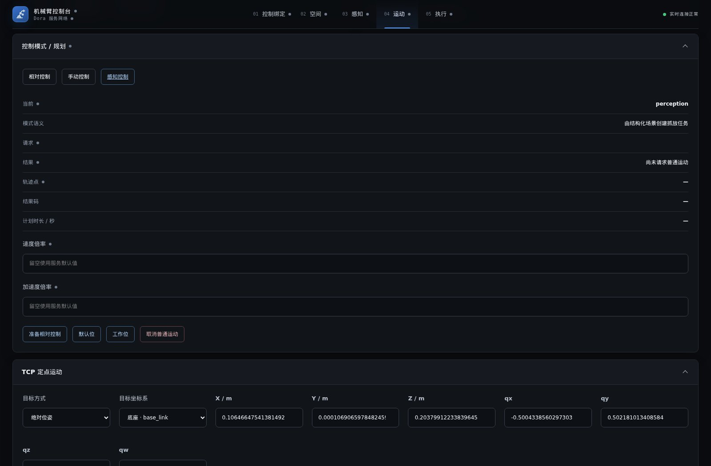

### 跟踪完整动作

完整抓放包括准备夹爪、接近目标、闭合夹持、持物经过工作位、移动到放置区域、释放以及返回工作位。页面显示正在进行的阶段，支持查看结果和取消任务。

用户可以看到规划是否完成、是否已经开始执行，以及结束时的状态。需要检查空间关系时，还可以打开三维规划视图，查看机械臂、环境与路径。

规划成功表示系统找到了可执行路径，不保证物体一定不会滑脱。实际抓取结果还需要结合相机画面和夹持反馈判断。

## 执行

负责将规划结果交给执行设备，并把关节状态带回页面。连接真机时读取电机实际反馈；不使用硬件时，可以由软件模拟提供虚拟关节反馈。

### 连接与实际姿态

- 从串口列表选择设备，也可以手动输入连接路径。
- 查看当前连接、断开原因和设备错误。
- 根据电机实际报告的角度显示机械臂姿态，而不是只播放预先生成的动画。
- 对比当前姿态、下发目标和夹爪状态，判断机械臂是否真正到位。
- 调整反馈读取间隔，并统一操作全部电机上力或卸力。

上力表示电机开始保持位置，卸力表示释放电机保持力。断开连接后的历史读数会与当前反馈区分，避免将旧姿态误认为实时状态。

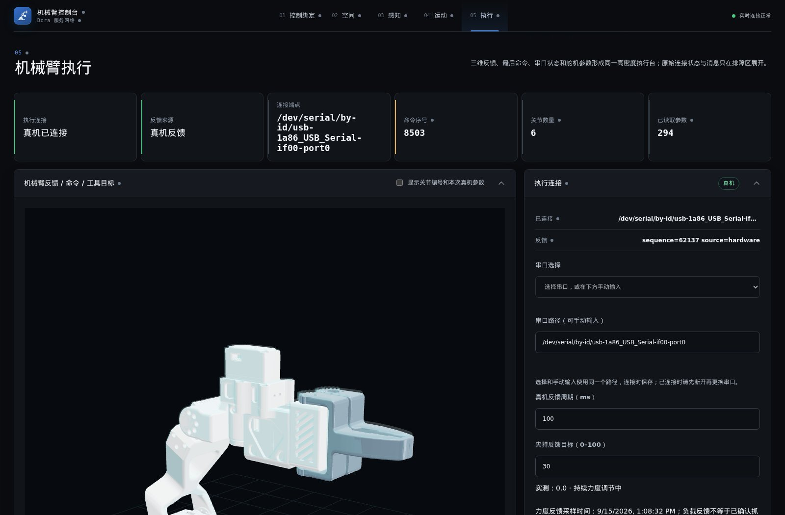

### 持续调节夹持

夹持并非把夹爪关闭到某个角度后就不再调整。平台读取驱动夹爪的电机（舵机）的负载反馈，在夹持与搬运期间持续调节输出，向设置的夹持目标靠近。

夹持目标使用 0–100 的反馈标度。页面可以查看目标值、当前负载和调节状态；明确打开夹爪或卸力时，持续夹持结束。

这个数值不是以牛顿计量的接触力。柔软物体、光滑物体和硬质盒子的表现可能不同，需要结合实际物体调整。负载变化可辅助判断夹持情况，但单独一个读数不能证明物体已经抓稳。

### 查看电机信息与参数

无需另开厂商工具，即可在页面查看电机报告的角度、状态、电压、电流、功率、温度原始数据和固件信息。参数界面说明各项参数的含义、单位、是否可写及生效方式。

支持的参数可以读取和修改，并显示进度、最新读数和错误。有些设置立即生效，有些需要重新上电；写入成功与已经生效会按参数说明区分。

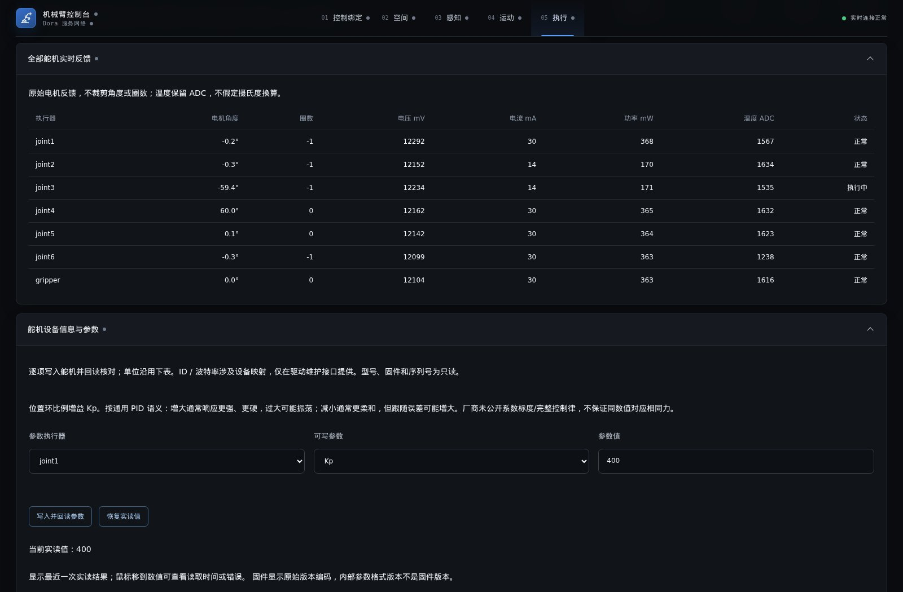

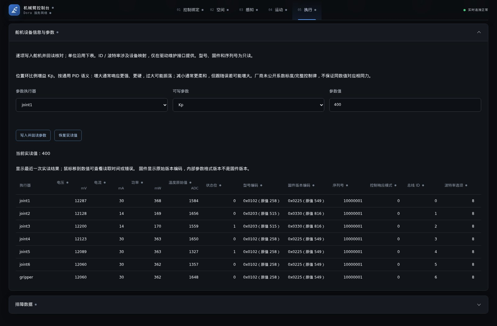

## 日常使用与适用范围

### 配置与历史记录

设备绑定、空间设置、相机配置和已确认的标定结果可以保存。AI 会话和任务记录也会保留，便于刷新后继续查看，而不必重新执行动作。

界面区分正在编辑的目标、实际生效的设置和设备反馈。任务状态用于说明软件执行进展，相机画面则帮助确认实际物体是否已经抓起和放好。

### 不使用外部 AI 也能工作

在依赖和模型文件准备好后，页面控制、本地物体识别与抓放不依赖外部大模型服务。自然语言操作需要可用的模型服务；是否需要互联网取决于该服务部署在哪里。

### 当前支持的设备

当前集成 StarArm-102 六轴机械臂、RA8-U35H-M 舵机和 RealSense D415 深度相机，并支持 SDL3 手柄与 NOLO CV1 输入。其他设备需要相应的适配与验证，不表示任意机械臂或相机均可直接使用。

项目已完成真实物体抓放，但并非工业级精密作业系统。相机视野、遮挡、透明或反光表面、标定误差、机械间隙以及物体与夹爪的接触情况，都可能影响结果。

## 技术组成与进一步阅读

页面基于 Next.js、React 与 Three.js；设备与业务服务主要使用 Rust 和 Dora；图像识别使用 YOLOE，抓取姿态生成使用 GraspGenX；运动规划使用 ROS 2 与 MoveIt。各服务通过 Docker 管理运行环境。

详细的实现、设备参数和部署方法请参阅：

- [架构与调用链](docs/BACKEND.md)
- [机械臂接入、舵机参数与精度说明](docs/STARARM-102.md)
- [Docker 与服务部署](docs/DOCKER.md)

截图来自实际运行界面，三维机械臂跟随设备反馈。截图中的读数是采集时的状态，不代表默认配置。
