[English](README.md) | 简体中文

# Robot Arm

以 AI 驱动的抓取与放置为核心的机器人控制平台，贯通自然语言任务、视觉识别、三维定位、路径规划与机械臂执行。

[AI 抓取与放置](#ai-驱动的抓取与放置) · [控制绑定](#控制绑定) · [空间](#空间) · [感知](#感知) · [运动](#运动) · [执行](#执行)

## AI 驱动的抓取与放置

Robot Arm 将自然语言指令转化为实际的物体搬运任务。AI 根据相机图像识别抓取物与放置区域，调用三维定位和抓取规划，并跟踪机械臂执行结果。任务对话、分割结果、实时视频与执行进度集中展示在浏览器中。

核心流程覆盖六个环节：

1. **任务解析**：确定抓取物、放置区域及多步操作顺序。
2. **视觉识别**：获取相机图像，通过模型识别或图像区域框选确定目标。
3. **三维定位**：结合对应深度与标定结果，计算物体和放置区的空间位置。
4. **抓取规划**：生成抓取候选，检查机械臂可达性、环境碰撞和完整搬运路径。
5. **动作执行**：完成接近、夹持、搬运、释放与返回工作位。
6. **结果检查**：结合任务状态、关节反馈和后续图像检查操作结果，为后续步骤提供依据。

### 实际任务示例

> 紫色物体放到红色框区域，然后再从红色框区域放到中心。

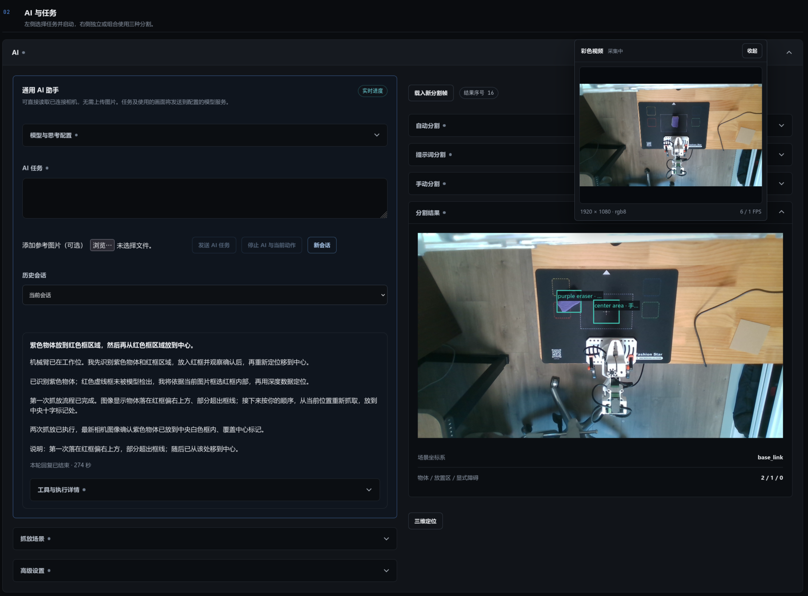

用户提供的实际操作截图：左侧为 AI 的识别、区域框选、抓放与图像检查记录；右侧大图为定位所用的分割画面，右上角为实时视频。记录保留了首次放置偏出红框的情况，随后按指令再次抓取并放至中心。

AI 通过平台已有功能组织任务，机械臂规划与执行由专用模块完成。模型回复、软件任务状态与实物操作结果分别展示，避免将对话结束等同于动作完成。

## 平台能力

平台围绕 AI 抓放提供相机管理、自动标定、多来源分割、运动控制、持续夹持与设备反馈。当前已在 StarArm-102 六轴机械臂和 RealSense D415 深度相机上完成实物抓放。

**支持无硬件运行。** 内置整套测试数据和虚拟关节反馈，覆盖图像识别、标定、抓放规划与模拟执行；无需连接机械臂、深度相机或手柄。

### 操作入口

| 入口 | 操作方式 | 应用范围 |
| --- | --- | --- |
| 自然语言 | 描述任务，由 AI 调用平台功能 | 查看场景、查询状态、控制运动和抓放 |
| 页面操作 | 图像查看、目标选择与显式执行 | 分步操作、参数调整与不依赖通用 AI 的抓放 |
| 手柄与空间控制器 | 通过按键、摇杆或设备移动控制机械臂 | 连续调整位置、朝向和夹爪开合 |

自然语言、页面操作与外部控制器共用运动规划和执行能力。

### 关键技术

| 技术能力 | 实现方式 | 作用 |
| --- | --- | --- |
| 多方式运动控制 | 关节目标、末端绝对/相对目标、MoveIt Servo 连续控制 | 统一处理直接控制、空间交互与任务运动 |
| 自动手眼标定 | ChArUco 检测、PnP、实际关节反馈与 OpenCV SHAH 求解 | 建立固定相机、机械臂底座和末端标定板之间的空间关系 |
| RGB-D 与三维重建 | SDK 彩深对齐、深度尺度换算、畸变处理与点云生成 | 将图像目标转换为机器人坐标中的三维对象 |
| 视觉抓取规划 | YOLOE 分割、GraspGenX 候选、MoveIt/MTC 完整任务求解 | 联合考虑目标识别、抓取姿态、可达性与搬运路径 |
| 环境碰撞检测 | Octomap 环境地图、目标接触规则与持物几何 | 区分环境障碍、夹指接触和抓取后的物体体积 |
| 持续夹持反馈 | Rust 执行节点、舵机负载回读与动态输出调节 | 在夹持和运输期间持续跟踪目标负载 |

### 五个模块

| 模块 | 主要用途 |
| --- | --- |
| 控制绑定 | 输入设备选择、动作绑定与反馈配置 |
| 空间 | 输入方向映射、移动比例与位置和朝向转换 |
| 感知 | 相机管理、标定、物体识别、三维定位与 AI 任务 |
| 运动 | 目标姿态设置、路径规划与完整抓放任务 |
| 执行 | 设备连接、关节反馈、持续夹持与电机参数管理 |

### 无硬件运行与测试数据

运行环境与模型文件准备完成后，平台支持不连接外部机器人设备的完整软件流程：

- **模拟相机与整套测试数据**：内置方块、置物筐和地面的测试场景，提供配套的彩色图、深度数据和相机参数，用于物体识别、三维定位及点云生成。
- **模拟标定**：提供配套标定板数据，可随虚拟机械臂姿态生成观测，运行采样与标定流程，无需实体标定板。
- **虚拟关节反馈**：执行层支持软件模拟，根据下发目标更新关节与夹爪状态，驱动页面中的三维机械臂姿态更新。
- **操作与抓放流程**：页面控制与模拟输入支持测试场景中的目标选择、识别、定位、路径规划和模拟执行。接入通用模型服务后支持 AI 任务编排。

模拟与真机共用业务流程，页面明确标识软件模拟与硬件反馈。模拟用于软件链路验证，不包含摩擦、滑脱等物理现象的完整仿真，不能替代实物抓取验证。

## 控制绑定

管理按键、摇杆及空间运动与机械臂动作之间的对应关系。设备绑定独立于运动逻辑，更换控制器通过配置完成。

### 设备接入

- 支持通过 SDL3 接入的手柄，以及 NOLO CV1 空间跟踪设备。
- 显示设备名称、连接状态和可用的按键、摇杆、位置与朝向信息。
- 位置与朝向支持独立设备输入或单设备统一输入。
- 页面提供平移与旋转方向控制，无需外部控制器。
- 设备名称与绑定配置持久保存。

### 动作绑定

支持单按键触发、摇杆连续控制和双按键正反向控制。夹爪开合、前后移动等动作均通过绑定指定输入，方向反转按项配置。

动作范围包括平移、绕弧移动、夹爪自身旋转、沿夹爪指向前进或后退，以及夹爪开合。支持振动的设备接收夹持负载反馈。

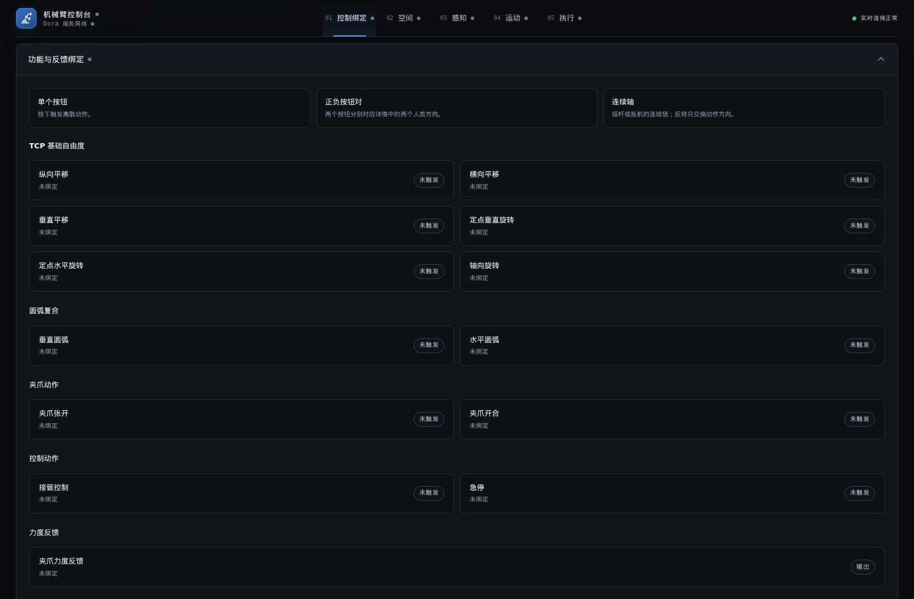

### 输入状态检查

页面显示实际按键、摇杆和空间输入，用于检查设备识别、动作绑定和方向映射。模拟输入支持无外部控制器条件下的配置验证。

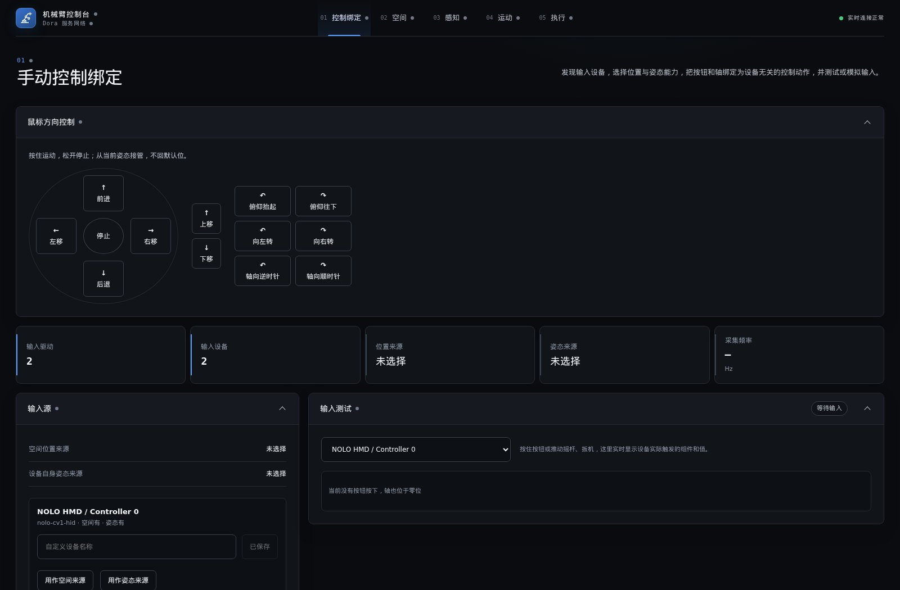

## 空间

统一配置输入设备与机械臂之间的方向映射、位移比例和旋转方式，明确设备运动对机械臂位置及夹爪朝向的影响。

### 方向映射与位移比例

- 配置输入方向与机械臂前后、左右、上下方向的对应关系。
- 通过移动比例缩放设备位移与机械臂位移。
- 开始接管控制时，以当时的设备姿态建立相对参考，之后按变化量控制。
- 对没有空间跟踪能力的手柄，使用按键或摇杆产生连续移动。
- 保存空间配置，并通过三维视图检查方向关系。

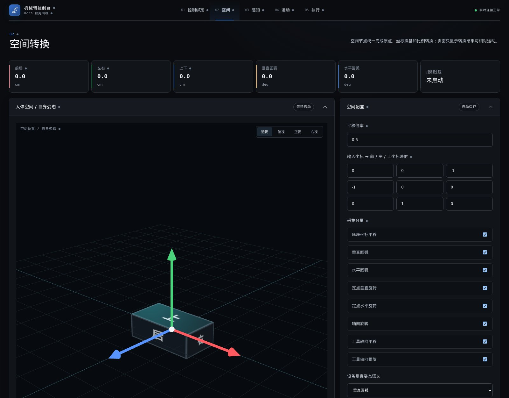

### 位置与朝向控制

位置控制与朝向控制独立处理。平移保持朝向与原位旋转分别对应不同的控制方式。

平台支持直线移动、绕弧移动、在当前位置调整朝向、绕夹爪自身轴线旋转，以及沿该轴线移动。各项动作支持独立启用与组合配置。

三维视图提供多方向观察、当前位移与旋转量显示，用于核对空间配置。坐标映射保存后持续生效。

### 空间变换与控制量

空间层通过方向映射矩阵、位移比例和接管时的参考姿态，将输入设备坐标转换为统一控制量。位置变化与旋转变化分别计算，旋转使用四元数表示。

跟踪设备提供相对参考姿态的变化；按键与摇杆输入按经过时间积分为位移和转角。控制分量覆盖底座平移、水平/垂直圆弧、末端原位旋转、工具轴向平移与螺旋运动，各分量独立配置。

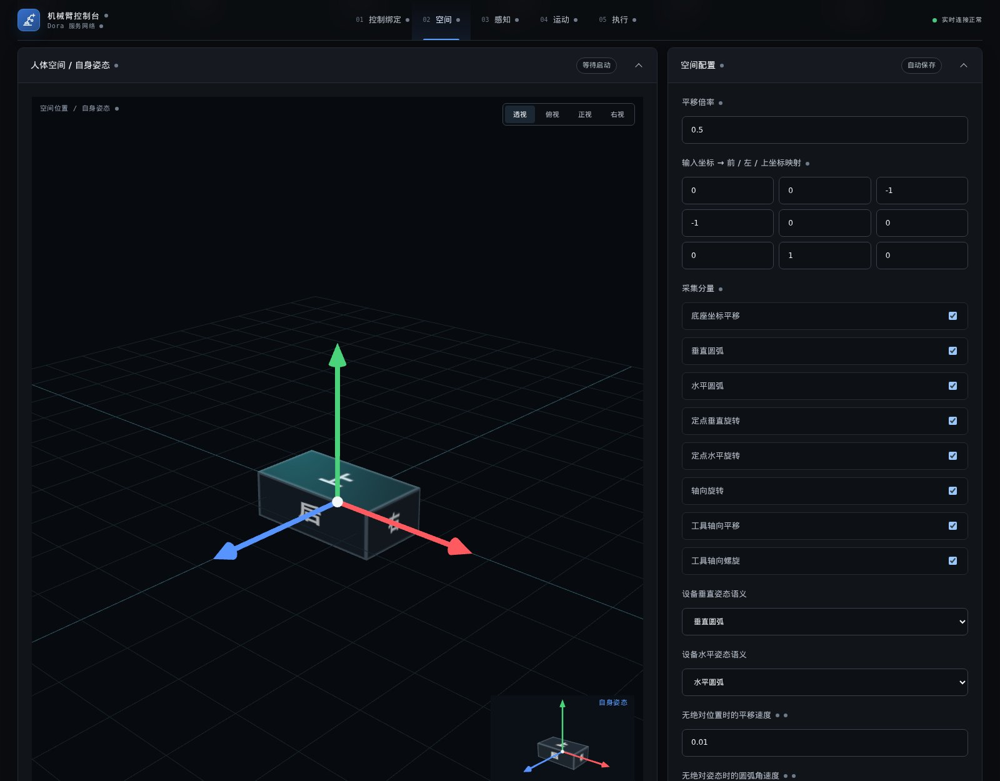

## 感知

为 AI 抓放提供图像观测、目标识别与空间定位。相机、标定、分割和 AI 任务集中在同一页面，各项功能支持独立调用与任务组合。

### 相机管理与图像采集

页面集中展示相机来源、设备信息、彩色图像和深度数据。彩色图像提供物体外观，深度数据提供相机至可见表面的距离，两者共同用于目标识别和三维定位。

- 根据设备实际支持的能力选择分辨率和帧率；不可用的配置显示为不可选。
- 独立配置相机采集帧率与下游取样频率，分离连续采集和按需识别。
- 查看实际运行的分辨率、帧率和采集状态，区分已选择的配置与当前生效的配置。
- 使用可拖动、可收起的彩色视频窗口观察现场，独立刷新深度预览。
- 查看并调整相机驱动提供的参数，保存设备配置。

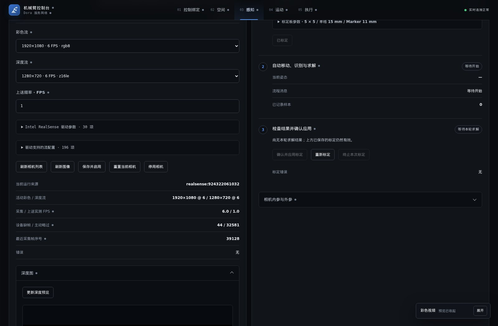

### 深度对齐与三维重建

深度处理从相机原始数据开始，保留真实分辨率、内参和深度单位，不根据预览图尺寸推断空间尺度。

1. **彩深对齐**：RealSense 驱动使用 SDK 的 Align，将深度映射到彩色图的像素坐标，供分割结果与深度逐像素对应。
2. **同帧数据关联**：彩色图、已对齐深度、内参、深度比例和已应用外参一并传递，后续定位始终使用分割对应的固定观测。
3. **深度转点云**：Z16 深度按设备报告的比例换算为米，结合内参与畸变模型恢复空间点，再通过外参变换到机械臂底座坐标。无效深度不作为实体点参与定位。
4. **实例与环境分离**：分割掩码和深度连续区域共同提取目标点云，其余有效点构成环境观测，分别供抓取推理和碰撞规划使用。

图像链路统一使用 RGB；仅在要求 BGR 的 OpenCV 边界转换。点云通过二进制数据传输，不展开为浏览器中的大体积 JSON 数组。实时视频与低频感知取样独立节流，模型推理不跟随视频每帧自动触发。

相机采集、SDK 对齐和标定计算由 Tokio 工作任务承载，节点事件循环负责命令与状态交互。视觉模型在计算服务中常驻加载，避免每次请求重复初始化。

### 自动手眼标定：固定相机与末端标定板

标定建立相机与机械臂底座之间的位置和朝向关系，将相机观测到的物体位置转换为机械臂运动所需的空间位置。

标定采用 ChArUco 黑白图案板。流程按预设姿态移动机械臂，采集图像并结合电机实际角度计算相机与机械臂的位置关系。页面展示当前姿态、已采集样本和计算结果。

标定流程包含移动、采样、求解和返回工作位。拟合误差供确认应用前检查；已保存结果在刷新或重启后持续有效，重新标定通过独立入口发起。

拟合误差反映样本一致性，不等同于整体作业精度。最终定位同时受标定板尺寸、相机深度质量和机械结构精度影响。

标定采用相机固定、标定板随末端运动的 **Eye-to-Hand** 布置，技术流程如下：

- **板位姿检测**：OpenCV ChArUco 检测角点，结合当前彩色内参与畸变参数，通过 PnP 求出标定板相对相机的位姿。
- **末端位姿计算**：每次图像采集后匹配新的电机实际角度反馈，经型号角度映射和正向运动学（FK）得到末端位姿；命令目标角度不作为实际观测替代。
- **联合求解**：调用 OpenCV 的 `calibrateRobotWorldHandEye`（SHAH），求解相机相对底座、标定板相对末端的固定变换。
- **结果检查**：记录图像重投影误差（像素）与各姿态的平移、旋转拟合残差，区分图像检测质量和空间拟合一致性。
- **采样追踪**：保存图像与关节反馈序号及采样时间，用于核对同次采样关系；该配对属于软件采样关联，不宣称相机与电机具有硬件级同步。

相机内参与深度单位来自所选采集配置；手眼标定求解的是外部空间变换，不等同于重新标定相机内参。

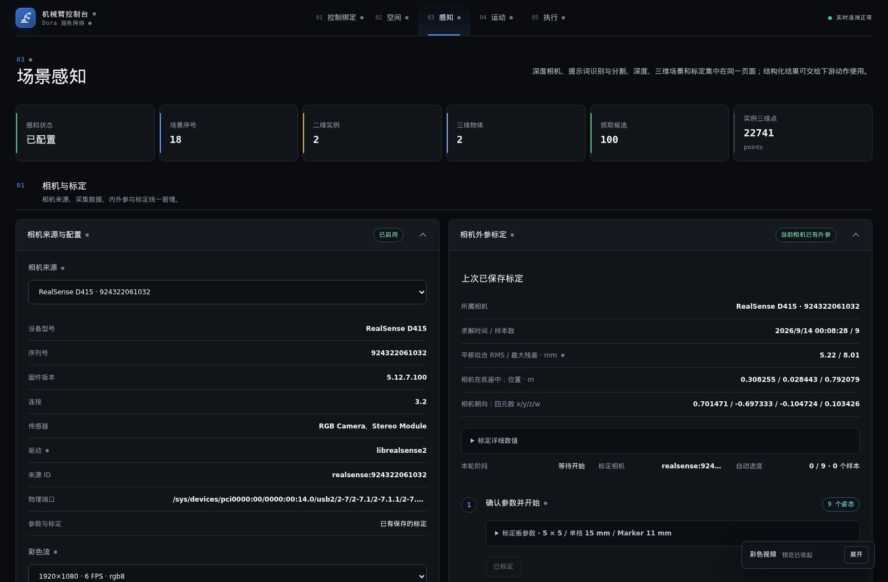

### 多来源目标分割

分割用于从图像中提取物体或区域。平台支持三种独立且可组合的来源：

| 方式 | 输入与作用 |
| --- | --- |
| 提示词分割 | 根据物体描述或参考图区域识别对应目标 |
| 自动分割 | 无需物体描述，由模型直接生成识别结果 |
| 手动分割 | 通过图像框选指定目标或放置区域及名称 |

结果统一显示于原图，并标明模型名称或人工标注来源。标签提供详情入口，人工编辑区仅展示人工标注。

各来源支持独立运行和清除，模型切换不影响其他来源的结果。人工框选用于明确指定目标与放置区域。

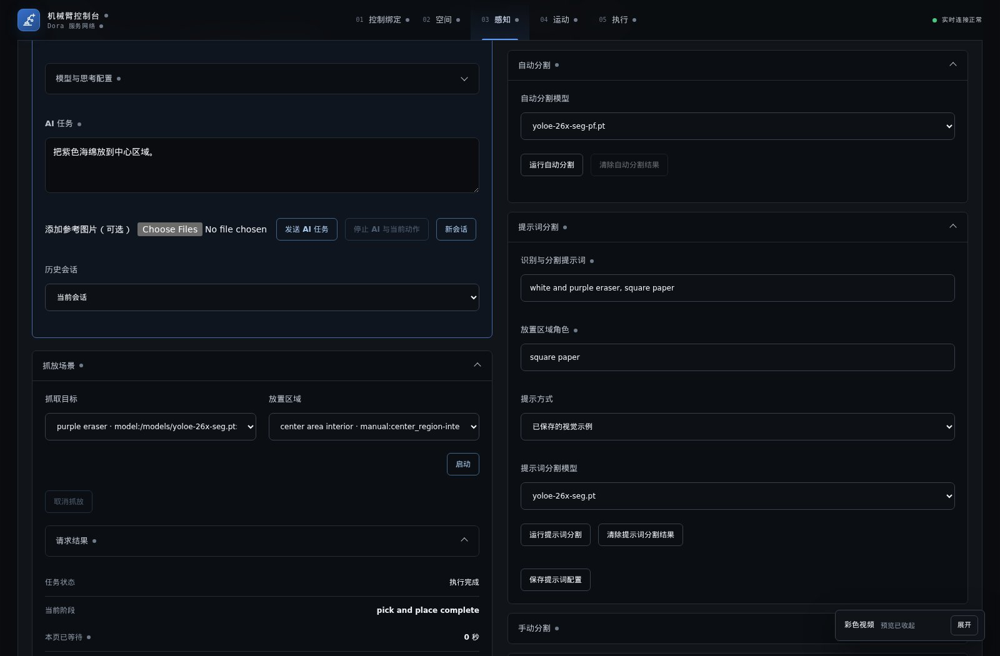

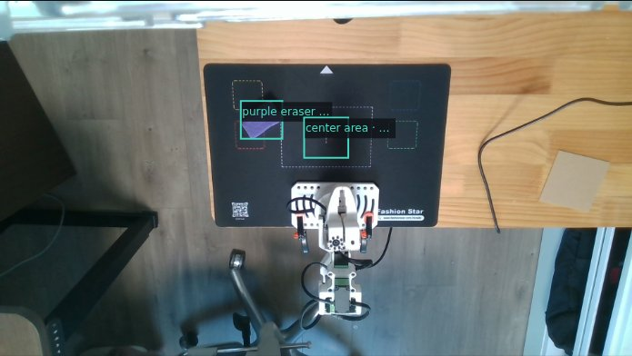

上图中，抓取物来自模型识别，中心放置区来自人工标注，并非全部由模型自动识别。

### 三维定位与抓取候选

系统依据目标对应的深度数据计算三维位置，并生成多种抓取候选姿态。运动模块结合可达性与后续搬运要求选择完整方案。

识别、三维定位和抓放独立触发。图像识别不依赖机械臂连接或外参标定；实物抓放依赖有效空间定位与硬件连接。

手动抓放通过结果查看、目标选择和任务启动完成。页面持续跟踪候选准备、规划、执行及最终状态。

抓取计算使用目标点云、非目标环境点云与当前夹爪几何资产。RGB 图像用于上游分割，GraspGenX 抓取网络本身以点云和夹爪几何为输入。环境距离筛选后，相近姿态按夹爪几何位移聚类，保留原始代表姿态及模型分数，最多返回 100 个候选。

模型分数与机械臂可执行性分别处理：感知层生成提议，运动层负责实际机械臂的 IK、碰撞和完整任务检查。分割、定位与候选均绑定观测序号，避免将不同帧的图像、深度和目标结果混用。

### AI 任务与模型配置

除核心抓放流程外，AI 工具覆盖图像观察、状态读取、分割定位、机械臂运动、夹爪调整与进度查询。

典型任务指令：

- “查看当前画面，说明有哪些物体。”
- “机械臂回到工作位。”
- “沿夹爪当前指向前进 1 厘米。”
- “把紫色海绵放到中心区域。”

图像输入支持系统相机与上传参考图。对话支持多轮上下文、历史会话和新建会话，工具操作与机器人任务提供关联详情。

模型名称和思考强度支持下拉选择或手动输入；思考强度用于向模型请求不同程度的推理，实际支持情况取决于模型服务。平台接入 OpenAI 兼容的 Responses 接口，可使用支持图像与工具调用的模型服务；服务部署支持本地网络与远程接口。任务文字和使用的图片会发送到所配置的服务，密钥仅在服务端使用。

AI 的回复与机械臂的执行结果分别展示。回复结束不代表动作已经完成，页面提供任务进度、真实反馈以及当前 AI 与动作的停止入口。

通用 AI 在 Next.js 服务端通过 AI SDK 运行工具调用循环。工具封装网页使用的同一组业务接口，并按原请求编号等待结果。语言模型负责理解与编排，局部视觉模型负责识别与抓取提议，机器人模块负责运动学和执行；图像与点云处理不由语言模型直接代替。

## 运动

负责目标姿态求解、路径规划与任务执行，统一处理手动目标、连续控制和视觉驱动的完整抓放任务。

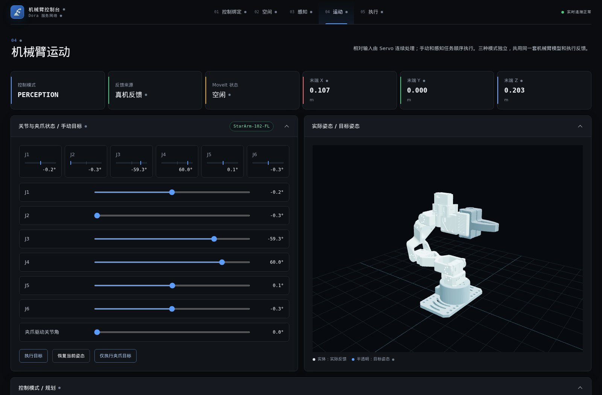

### 目标设置与执行预览

关节编辑与动作执行分离。页面同步显示实际反馈姿态和待执行目标，目标修改经执行按钮确认后下发。

目标支持关节角度、夹爪末端位置与朝向，以及相对当前位置的运动。相对运动区分底座方向与夹爪自身方向，分别适用于工作空间调整和沿工具指向的接近动作。

支持工作位等预设姿态、独立夹爪控制，以及按住移动、松开停止的连续控制。目标预览展示设定姿态，可达性和路径有效性由规划结果确定。

工作位是预先设置的一组机械臂关节位置，用作动作的起点或结束位置。

### 控制模式与坐标语义

| 控制模式 | 输入 | 求解与执行 |
| --- | --- | --- |
| 关节目标 | 各关节角度与预设姿态 | MoveGroup 规划至目标关节配置 |
| 末端目标 | 工具中心点（TCP）的位置与朝向 | IK 将末端目标转换为关节解，再规划完整路径 |
| 相对末端运动 | 底座系或工具系中的位移与旋转增量 | 从任务开始时的实际反馈计算起点，按指定坐标系生成目标 |
| 连续控制 | 手柄、跟踪设备或网页产生的连续位姿目标 | 带当前 ROS 时间戳的 MoveIt Servo 位姿控制 |
| 视觉抓放 | 目标、放置区、候选与环境观测 | MTC 分阶段规划并执行完整抓放方案 |

工具系平移沿末端当前朝向解释，底座系平移沿固定工作空间方向解释。位置与朝向分别处理，避免将旋转指令隐式转换为位置变化。

连续控制与离散任务由同一运动节点调度。离散任务执行期间暂停 Servo 目标发送，完成后恢复；机器人模型和规划器资源常驻复用，单次任务更新场景并构造所需阶段。

### 完整抓放方案规划

规划从多种抓取候选中选择完整可执行方案，模型评分不作为唯一依据。检查范围包括目标可达性、夹爪接近路径，以及夹持后的搬运和放置路径。

MoveIt 根据机械臂几何、关节范围和相机观测的环境检查运动路径。持物阶段将被夹持物体的体积纳入碰撞检查。

抓取深度优化结合夹爪几何和完整路径有效性。碰撞处理区分必要的夹爪与目标接触和环境障碍碰撞。

### 场景碰撞与抓取深度

- **环境地图**：相机点云通过 MoveIt 的 Octomap 组件建立任务场景快照，保留观测到的环境结构，不将所有物体简化为实心盒。
- **目标接触**：待抓物体独立管理，夹指与目标之间的必要接触通过碰撞许可配置处理；环境障碍继续参与检查。
- **持物运输**：抓取后将目标作为末端附着物参与规划，避免原位置障碍与持物几何重复计算。
- **深度精修**：沿候选接近方向搜索更深的抓取位置，每个变体都需通过接近、夹持和后续运输的完整方案检查，不单以物体竖直高度限制接近距离。
- **单次完整执行**：首条完整方案产生后，对选中候选进行同场景精修，最终执行一条完整轨迹方案；不在接近后重新采图并隐式更换抓取目标。

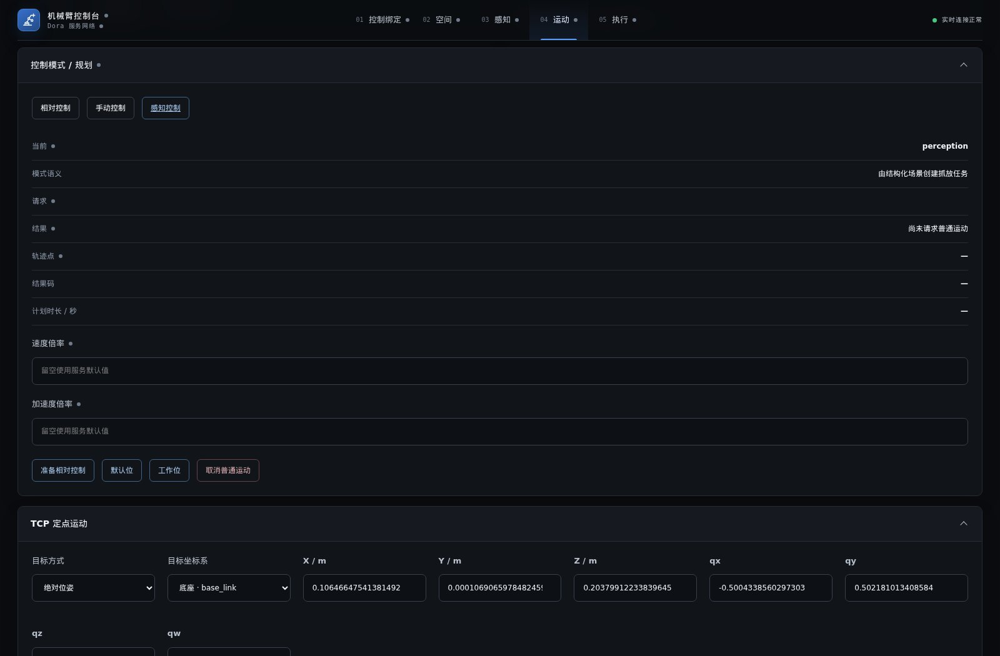

### 执行阶段与结果

完整抓放包括准备夹爪、接近目标、闭合夹持、持物经过工作位、移动到放置区域、释放以及返回工作位。页面显示正在进行的阶段，支持查看结果和取消任务。

页面区分规划、执行与终态，并提供三维规划视图，用于检查机械臂、环境和路径的空间关系。

规划成功表明存在可执行路径，不构成物理夹持成功的证明。实物结果依据相机画面和夹持反馈判断。

## 执行

负责规划动作下发与关节状态回读。真机运行使用电机实际反馈，无硬件运行使用软件模拟的虚拟关节反馈。

### 连接与实际姿态

- 支持串口列表选择与连接路径手动输入。
- 查看当前连接、断开原因和设备错误。
- 根据电机实际报告角度更新机械臂姿态。
- 对照当前姿态、下发目标和夹爪状态，检查实际到位情况。
- 调整反馈读取间隔，并统一操作全部电机上力或卸力。

上力启用电机位置保持，卸力释放保持力。页面区分历史读数与实时反馈，并标识连接中断状态。

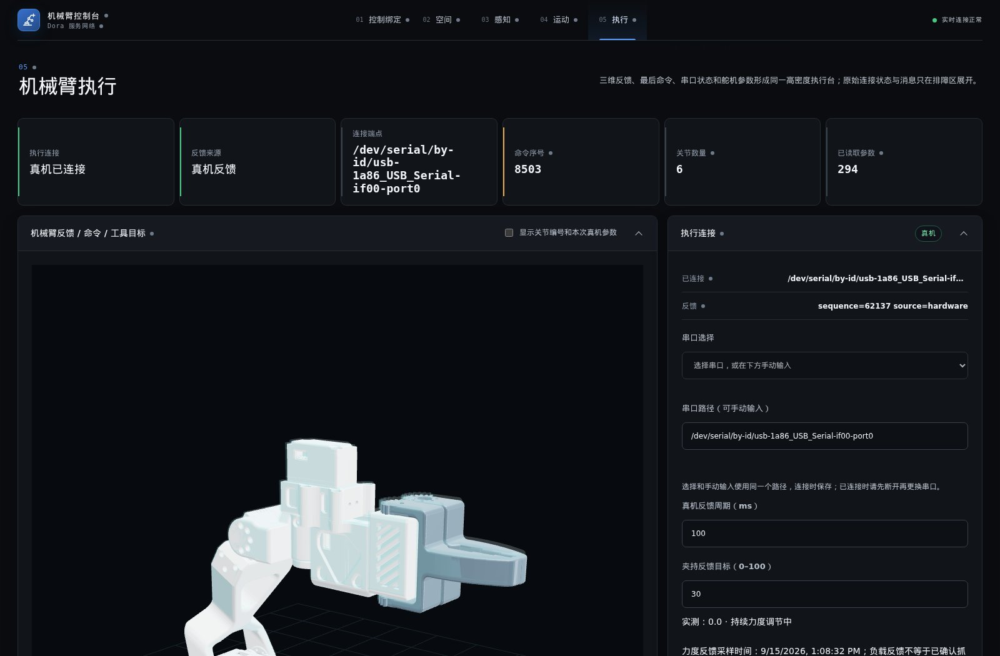

### 持续夹持控制

平台读取夹爪舵机的负载反馈，在夹持与搬运期间持续调节输出以跟踪夹持目标，不以首次达到目标时的角度作为固定保持位置。

夹持目标使用 0–100 的反馈标度。页面显示目标值、当前负载和调节状态；明确打开夹爪或卸力时，持续夹持结束。

该标度表示负载反馈，并非以牛顿计量的接触力。夹持参数需结合物体材质、表面摩擦和形变情况调整；负载读数用于辅助判断，不能单独证明稳定夹持。

调节器按新到达的舵机监测样本更新输出功率，持续作用于持物阶段。目标负载、测得负载、实际控制输出与采样时间分别记录，不将固定角度或固定功率等同于保持力。

### 串口调度与反馈一致性

Rust 执行节点统一管理同一串口上的运动指令、状态回读和参数访问。查询与回包按事务串行处理，运动等待期间只保留最新待发目标，避免多个异步任务交错读取同一串口。

实际电机角度与命令目标分别保存。断连清除待发目标，重连不重放积压运动；已选择的真实端点离线时报告连接错误，不自动伪装为软件反馈。虚拟关节反馈仅用于明确的软件模拟状态。

### 电机信息与参数管理

页面集中展示电机报告的角度、状态、电压、电流、功率、温度原始数据和固件信息。参数界面说明各项参数的含义、单位、是否可写及生效方式。

参数读取与修改提供进度、最新读数和错误信息。参数说明区分立即生效与重新上电生效的设置，写入结果不替代生效条件检查。

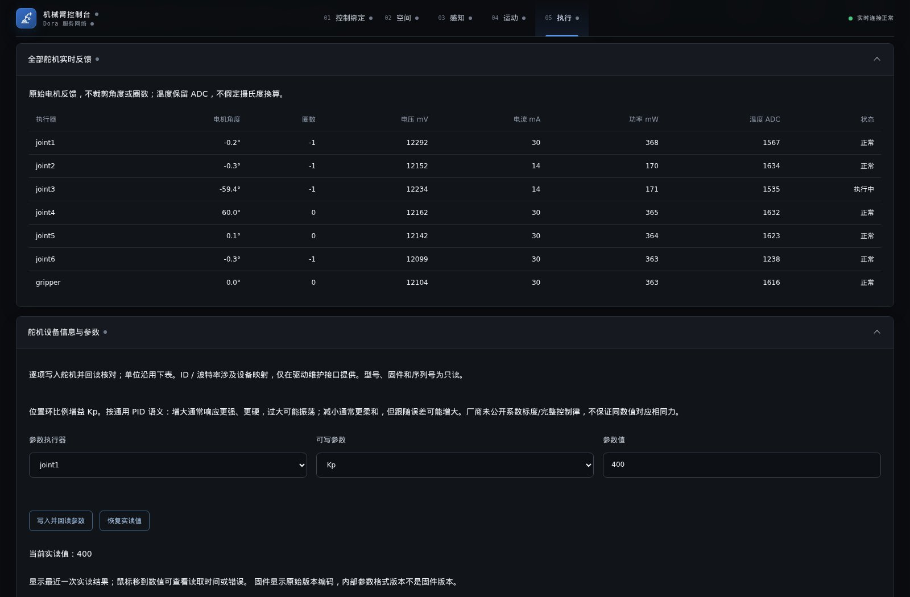

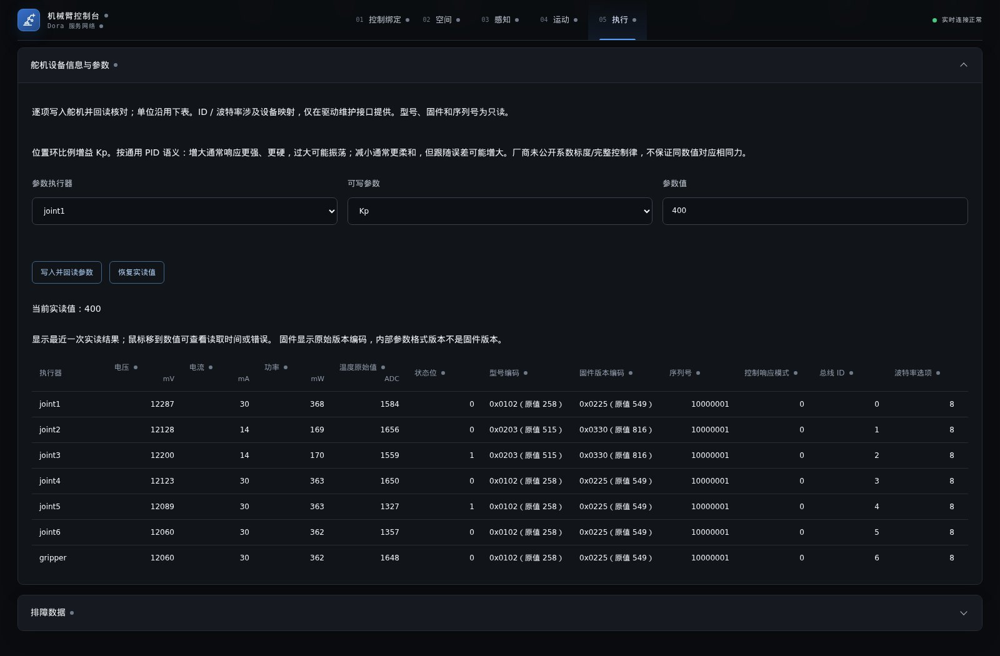

## 运行环境与适用范围

### 配置与历史记录

设备绑定、空间设置、相机配置、已确认标定、AI 会话与任务记录持久保存。页面刷新恢复状态查询，不重复执行动作。

界面分别展示目标草稿、生效配置和设备反馈。任务状态反映软件执行进度，相机画面用于核对实物抓取与放置结果。

### 本地运行与模型服务

运行依赖与模型文件就绪后，页面控制、本地识别与抓放不依赖外部大模型服务。自然语言操作依赖可用的模型服务，互联网需求由其部署位置决定。

### 当前支持的设备

当前集成 StarArm-102 六轴机械臂、RA8-U35H-M 舵机和 RealSense D415 深度相机，并支持 SDL3 手柄与 NOLO CV1 输入。其他设备需要相应的适配与验证，不表示任意机械臂或相机均可直接使用。

项目已完成真实物体抓放，但并非工业级精密作业系统。相机视野、遮挡、透明或反光表面、标定误差、机械间隙以及物体与夹爪的接触情况，都可能影响结果。

## 技术组成与进一步阅读

页面基于 Next.js、React 与 Three.js；设备与业务服务主要使用 Rust 和 Dora；图像识别使用 YOLOE，抓取姿态生成使用 GraspGenX；运动规划使用 ROS 2 与 MoveIt。各服务通过 Docker 管理运行环境。

详细的实现、设备参数和部署方法请参阅：

- [架构与调用链](docs/BACKEND.md)
- [机械臂接入、舵机参数与精度说明](docs/STARARM-102.md)
- [Docker 与服务部署](docs/DOCKER.md)

截图来自实际运行界面，三维机械臂跟随设备反馈。截图中的读数是采集时的状态，不代表默认配置。
